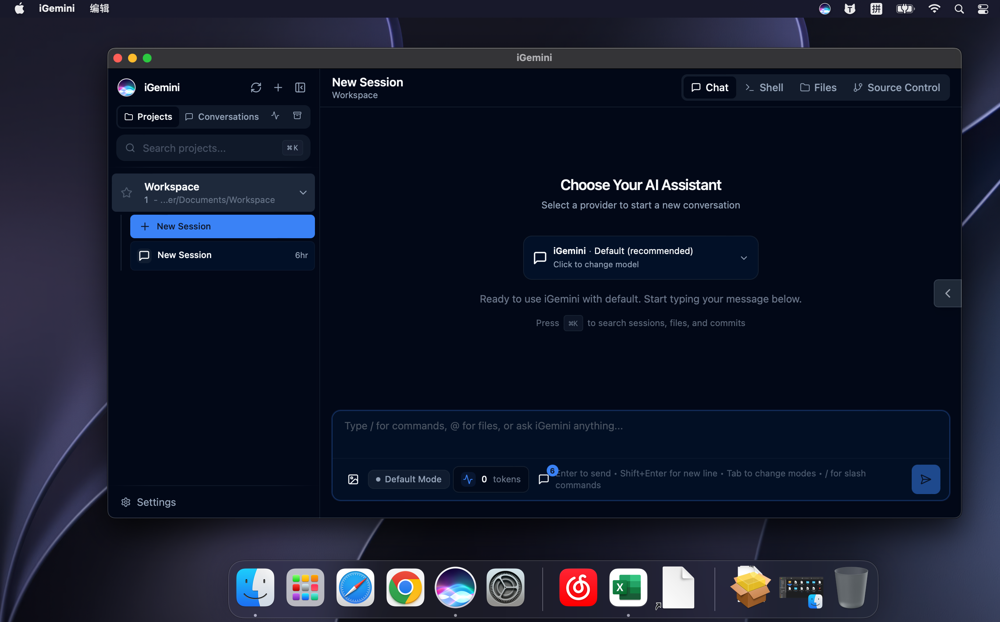

# iGemini

<p align="right"><b>English</b> · <a href="README.md">简体中文</a></p>

This project grew out of a prank: install macOS on a Google Pixelbook Go, write the AVS audio and IPU3 camera drivers, bolt on the AI powers Apple never gave it — and then keep a straight face on YouTube claiming Google and Apple had secretly co-built a laptop.



> **Disclaimer.** iGemini is a hobby / educational project. It is **not** affiliated with, endorsed by, or connected to Google (Gemini), Anthropic (Claude), or Apple (Siri) in any way.

---

## What it is

iGemini is a **local, browser-based AI assistant** that works out of the box. Open it, and from your browser you can chat with an AI, let it search the web, read images (OCR), read/write documents, run code, and use a terminal. **Everything it needs to run (runtime, model toolchain, capability dependencies) is bundled into the offline installer — install once, and it just works, nothing else to set up.**

You supply exactly one thing: **an API key** (see "Configure keys" below). The key is stored only on your machine and is never uploaded.

Under the hood it stitches three things together: the **claudecodeui** web UI ([siteboon](https://github.com/siteboon/claudecodeui), AGPL-3.0, white-labeled to iGemini) + **Claude Code** as the agent engine + **DeepSeek** as the model backend.

---

## What you can do with it

| Capability | What it does |
|---|---|
| 🧠 **Reason & answer** | Clarify requirements, propose solutions, write copy, reason through problems (backed by a reasoning-grade LLM) |
| 🌐 **Web search** | Let the AI go online for the latest info before answering |
| 👁️ **Image understanding / OCR** | Understand images, extract text from them (screenshots, scans, photos) |
| 📄 **Documents** | Read text from PDF / Word / Excel (scans auto-OCR'd); export to PDF / Word |
| 📊 **Spreadsheets** | Read/write, pivot, merge, and compute over CSV / Excel |
| 💻 **Coding** | Write code, fix bugs, run commands, build small tools |
| 🖥️ **Integrated terminal** | Built-in shell — type commands / run AI sessions right in the page |
| 📁 **Files & source control** | Browse project files, view git changes |

---

## Install

Download the installer for your platform and double-click to install (regular user privileges, no admin needed; any old version is stopped automatically first).

| Platform | Download (v1.1.0) |
|---|---|
| **macOS (Apple Silicon / M-series)** | [iGemini-Installer-arm64-v1.1.0.pkg](https://github.com/DexterSLamb/iGemini/releases/download/v1.1.0/iGemini-Installer-arm64-v1.1.0.pkg) |
| **macOS (Intel)** | [iGemini-Installer-x64-v1.1.0.pkg](https://github.com/DexterSLamb/iGemini/releases/download/v1.1.0/iGemini-Installer-x64-v1.1.0.pkg) |
| **Windows 64-bit** | [iGemini-Setup-x64-v1.1.0.exe](https://github.com/DexterSLamb/iGemini/releases/download/v1.1.0/iGemini-Setup-x64-v1.1.0.exe) |
| **Linux (Debian / Deepin family)** | Backend + native WebKitGTK shell are done; a one-click installer isn't built yet — see "Build from source" below |

After installing, it starts the background service and opens the iGemini window; from then on it **auto-starts on login** — just open it whenever.

> Not sure which chip your Mac has?  → "About This Mac". "Apple M…" → pick arm64; "Intel" → pick x64.

---

## Configure keys (required on first use)

iGemini has no AI compute of its own — you provide a **model-service key** to get started. Keys are **stored in plain text only on your machine**; they never go into the installer and are never uploaded to any iGemini server.

| Key | Required? | Purpose | Where to get it |
|---|---|---|---|
| **DeepSeek API Key** | ✅ **Required** | The model backend (the brain for chat / reasoning / coding) | platform.deepseek.com |
| **Serper API Key** | Optional | Better web search (there's a built-in fallback if omitted) | serper.dev (free tier is enough) |
| **Qwen API Key + Base URL** | Optional | Image understanding / OCR (via Alibaba Qwen vision models) | Alibaba Cloud Bailian / DashScope |

### How to enter them

- **Windows**: the installer has an "Enter API keys" page — DeepSeek is required, the rest optional. **If the machine already has a DeepSeek key, this page is skipped automatically.**
- **macOS**: on first launch, if there's no DeepSeek key yet, a small window pops up for you to enter one.
- **Change them anytime (recommended)**: open "**Configure keys…**" inside iGemini, fill in and save — on save it **validates the DeepSeek key online**, and once it passes, the background service restarts automatically.
  - **macOS**: menu bar `iGemini` → `Configure keys…`
  - **Windows**: press `Alt + Space` (or click the icon at the top-left of the title bar) → `Configure keys…`
- **Advanced: edit the files directly** (restart the iGemini service to take effect):
  - DeepSeek: `~/.config/deepseek/key`
  - Serper: `~/.config/deepseek/serper_key`
  - Qwen: `~/.config/qwen/key`, `~/.config/qwen/base`
  - (Same on Windows, under `%USERPROFILE%\.config\`)

---

## Privacy & notes

- **Local-first**: iGemini itself, your conversation history, and your keys all live on your own computer — nothing goes through a relay server.
- **Where AI requests go**: your prompts are sent to the model services you configured (DeepSeek / Qwen / Serper) for processing — unavoidable when using AI, so use your judgment with sensitive content.
- **The green dot**: after a reply finishes, the green dot next to a conversation may keep pulsing for a moment before going out — that's just the model connection winding down. The reply was delivered long before; nothing is wrong.
- **Not Apple, not Google**: the name is a joke — under the hood it's the Claude Code engine + DeepSeek / Qwen models, with no connection to Apple or Google.

---

## Build from source

This is a **source repository** (AGPL-3.0 — build it / audit it yourself). Each platform produces a self-contained offline installer; build on a machine of the **target OS**:

- **macOS** (on Apple Silicon; cross-compiles the Intel shell):
  ```sh
  bash scripts/macos/installer/build-pkg.sh arm64   # → iGemini-Installer-arm64-vX.Y.Z.pkg
  bash scripts/macos/installer/build-pkg.sh x64      # → Intel
  ```
- **Windows** (native x64):
  ```powershell
  powershell -ExecutionPolicy Bypass -File scripts\windows\installer\build-installer.ps1
  iscc scripts\windows\installer\iGemini.iss          # → iGemini-Setup-x64-vX.Y.Z.exe
  ```
  See also the GitHub Actions build in `.github/workflows/`.
- **Linux** (Debian / Deepin family):
  ```sh
  bash scripts/linux/setup.sh                          # backend + tools + service
  # native shell: scripts/linux/shell-app/igemini-shell.py (GTK3 + WebKitGTK)
  ```

> If the default binary sources are slow in your region, pass a proxy: `PROXY=http://127.0.0.1:7897 bash …` (or PowerShell's `-Proxy …`); otherwise it connects directly.

**Data flow**: `Browser ⇄ claudecodeui (iGemini) ──spawn──▶ claude CLI ──env──▶ api.deepseek.com/anthropic`. The child process inherits the launcher's environment, so injecting the DeepSeek config at start-up routes the whole chain through DeepSeek; the service binds `127.0.0.1:8888` (local only). Keys are injected at runtime from `~/.config/deepseek/key` — never hard-coded, never committed.

This repository does **not** contain the source of Claude Code or claudecodeui — claudecodeui is fetched at a pinned upstream commit and white-labeled by applying [`vendor/igemini-claudecodeui.patch`](vendor/igemini-claudecodeui.patch) (**applied, never forked**). The single-source version number lives in `scripts/<os>/installer/VERSION`.

---

## License

This repository is licensed under **AGPL-3.0** (see [`LICENSE`](LICENSE)). It includes a patch derived from claudecodeui (© [siteboon](https://github.com/siteboon/claudecodeui), AGPL-3.0); see [`NOTICE`](NOTICE) for full third-party attribution and the corresponding-source statement.

*Works out of the box. Drop in a key, and let it do the rest.*
